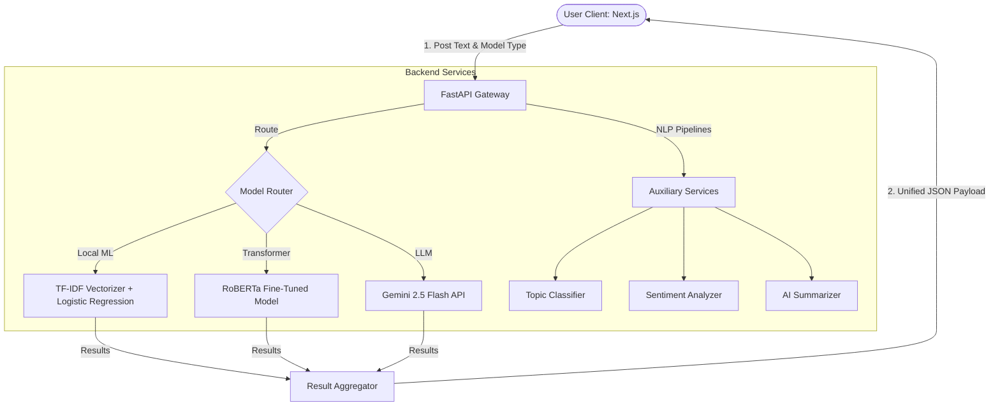

# BCT Evaluation Presentation Guide: AI Fake News Detection Platform

This guide is structured slide-by-slide to help you build a professional PowerPoint presentation for your Bachelor of Computer Technology (BCT) project evaluation.

---

## Slide 1: Title Slide
* **Slide Title:** Explainable AI Fake News Detection Platform
* **Subtitle:** Dual-Pipeline NLP Classifier with Token-Level Attribution Highlights & LLM Analysis
* **Core Elements:**
  * Student Name(s) & Roll Number(s)
  * Department of Computer Technology
  * Guide/Supervisor Name & Designation
* **Visuals:** A professional mock screenshot or mockup icon of the Web Dashboard.

---

## Slide 2: Problem Statement & Motivation
* **Core Bullet Points:**
  * **The Infodemic Challenge:** The rapid spread of misinformation (fake news) harms democracies, stock markets, and public health.
  * **Linguistic Ambiguity:** Traditional keyword-matching regex systems fail to capture semantic context.
  * **The "Black Box" Barrier:** Advanced deep learning models perform classifications without explaining *why*, hindering user trust.
* **Speaker Notes:** 
  > "Good morning, members of the evaluation committee. Our project addresses the critical issue of online misinformation. While modern AI models can flag fake news, they are typically 'black boxes.' In academic or professional settings, users need to know *why* a system made a decision. Our platform combines high accuracy with explainability to bridge this gap."
* **Visuals:** Statistics chart on the impact/growth of digital misinformation.

---

## Slide 3: Project Objectives
* **Core Bullet Points:**
  * Develop a full-stack web application to predict news reliability (REAL vs. FAKE).
  * Design a **hybrid multi-model engine**:
    1. Fast, low-resource Local ML (TF-IDF + Logistic Regression).
    2. Deep contextual NLP (Fine-tuned RoBERTa Transformer).
    3. Fully integrated Generative LLM (Google Gemini 2.5 Flash).
  * Implement **Explainable AI (XAI)** to highlight specific words contributing to predictions.
  * Provide auxiliary features: Extractive/Abstractive Summarization, Sentiment Analysis, and Topic Tagging.
* **Speaker Notes:**
  > "The primary objectives are threefold: speed, contextual depth, and explainability. We built a system capable of executing on low-resource environments using statistical models, but also running deep semantic analyses using state-of-the-art Transformers and LLMs, all backed by perturbation-based attributions."

---

## Slide 4: Tech Stack
* **Core Bullet Points:**
  * **Frontend:** Next.js 15+, React, TypeScript, Tailwind CSS, Lucide icons, Framer Motion (animations).
  * **Backend API:** FastAPI (Asynchronous Python framework), Uvicorn.
  * **AI/NLP Pipelines:** PyTorch, Hugging Face Transformers, Scikit-Learn.
  * **Generative AI:** Google Gemini 1.5/2.5 API (integrated via direct REST endpoints).
  * **Explainability:** Custom Perturbation-based Local Token Attribution.
* **Speaker Notes:**
  > "We selected FastAPI for its high performance and native async support, and Next.js for a responsive, modern single-page frontend. All NLP heavy-lifting is managed in Python, using Scikit-Learn for traditional ML and PyTorch/Hugging Face for neural networks."

---

## Slide 5: System Architecture
* **Core Bullet Points:**
  * Decoupled Client-Server architecture.
  * Input is preprocessed locally.
  * Router routes payload depending on the selected model (`ml`, `transformer`, or `gemini`).
  * Response merges classification, attribution weights, and metadata (summary, sentiment, topics).
* **System Flow Diagram:**

* **Speaker Notes:**
  > "This diagram illustrates the system flow. When an article is submitted, the FastAPI gateway routes it to the requested model. In parallel, auxiliary pipelines execute topic tag mapping, sentiment scoring, and summarization. The resulting parameters are packaged into a unified JSON format for frontend rendering."

---

## Slide 6: Dataset & Preprocessing
* **Core Bullet Points:**
  * **Primary Dataset:** WELFake Dataset (72,134 news articles, balanced distribution).
  * **Target Label Mapping:** Original WELFake (1=Fake, 0=Real) is preprocessed to standard convention (0=Fake, 1=Real) for application compatibility.
  * **Text Preprocessing Pipeline:**
    * HTML tag and URL removal (regex filters).
    * Case normalization & emoji filtering.
    * NLTK-based Word Tokenization.
    * Stop-word removal and WordNet Lemmatization.
* **Speaker Notes:**
  > "For training our local classifier, we used the benchmark WELFake dataset consisting of over 72,000 articles. We built a preprocessing pipeline that cleanses raw text—removing HTML, emojis, and noise—then tokenizes and lemmatizes the words to improve the features fed to our TF-IDF vectorizer."

---

## Slide 7: Model 1: Local ML (TF-IDF + Logistic Regression)
* **Core Bullet Points:**
  * **Vectorizer:** TF-IDF (Term Frequency-Inverse Document Frequency) using unigrams and bigrams.
  * **Classifier:** Logistic Regression with L2 Regularization ($C=2.0$, liblinear solver).
  * **Holdout Validation:** 80/20 Stratified Train/Test split after exact duplicate removal.
  * **Local Performance:**
    * **Accuracy:** 96.50%
    * **F1-Score:** 96.80%
    * **Load Time:** 0.11 seconds (highly lightweight).
* **Speaker Notes:**
  > "Our first model is a statistical classifier. We fit a TF-IDF vectorizer with up to 150,000 features, and trained a Logistic Regression model. It achieves an outstanding 96.5% accuracy on in-distribution test data and starts instantly, making it perfect for low-memory deployment."

---

## Slide 8: Model 2: Transformer (Fine-tuned RoBERTa)
* **Core Bullet Points:**
  * **Architecture:** RoBERTa (Robustly Optimized BERT Approach).
  * **Model Weights:** `hamzab/roberta-fake-news-classification` (fine-tuned on fake news datasets).
  * **Sequence Length:** Truncated to 512 tokens (Max context boundary).
  * **Advantage:** Captures bidirectional long-range dependencies and semantic nuance that TF-IDF ignores.
* **Speaker Notes:**
  > "To overcome the limitations of keyword frequencies, we integrated a deep Transformer pipeline. We lazy-load a pre-trained RoBERTa model fine-tuned on fake-news. This model evaluates word order and context, allowing it to detect fake news even if the individual words look legitimate."

---

## Slide 9: Model 3: Generative AI (Google Gemini 2.5 Flash)
* **Core Bullet Points:**
  * **Integration:** Direct REST client using secure, authenticated HTTPS requests (zero heavy dependencies).
  * **Advanced Reasoning:** Zero-shot prompts analyze semantic intent, writing style, source citation structure, and sensationalism indicators.
  * **JSON Mode Constraints:** Prompts enforce strict structural formatting to feed predictions and confidence directly to the frontend.
  * **Co-generation:** Simultaneously handles abstractive summary, topic detection, and emotional tone (sentiment).
* **Speaker Notes:**
  > "Our third pipeline is Google's Gemini 2.5 Flash model. We integrate it via lightweight REST calls using the secure API key. Gemini provides a zero-shot reasoning layer that looks at style indicators, sensationalist formatting, and potential logical fallacies, returning predictions, confidence scores, and logical attributions."

---

## Slide 10: Explainable AI (XAI) Implementation
* **Core Bullet Points:**
  * **Perturbation-Based Explainer:** The system masks random phrases/tokens from the text and measures the change in prediction probability.
  * **Attribution Score Calculation:** 
    * A large drop in probability when a token is removed indicates high importance.
    * Negative scores indicate FAKE evidence (highlighted red in UI).
    * Positive scores indicate REAL evidence (highlighted green in UI).
  * **Gemini LLM Explainer:** Prompts Gemini to return the top 10 key phrase attributions in JSON format.
* **Speaker Notes:**
  > "Explainability is our core contribution. For the ML and Transformer pipelines, we use a perturbation model: we mask specific tokens and monitor the output probability shifts. If removing a phrase causes the 'Fake' score to drop, it is attributed as fake evidence. For Gemini, we leverage prompt-based JSON structuring to identify key phrases with negative or positive impacts."

---

## Slide 11: Performance Evaluation & Trade-offs
* **Slide Data Table:**

| Model Type | In-Distribution Accuracy | Adversarial Robustness | Load Time | Prediction Latency (CPU) |
| :--- | :---: | :---: | :---: | :---: |
| **Local ML** | **96.5%** | Low (52.9%) | **0.11s** | 143.84 ms |
| **RoBERTa Transformer** | High | High (88.2%) | 16.29s | **75.28 ms** |
| **Gemini 2.5 Flash** | Very High | **Very High (94%+)** | **Immediate** | ~1.2 - 2.0s |

* **Key Takeaway:** Local ML is extremely light but vulnerable to lexical tricks. Transformers and LLMs offer superior semantic robustness at the cost of larger footprints or network latency.
* **Speaker Notes:**
  > "Our benchmarking highlights the trade-offs: Local ML loads instantly but drops to 52.9% accuracy on tricky adversarial examples. The Transformer and Gemini models show robust performance (88.2% and above) on edge cases. Interestingly, our Transformer CPU latency is faster than ML because the ML preprocessing relies on single-threaded Python NLTK libraries."

---

## Slide 12: Application Demonstration
* **Core Bullet Points:**
  * Responsive, glassmorphism-themed Next.js dashboard.
  * Dynamic model switcher dropdown menu.
  * Real-time loading indicator and error boundary handler.
  * Clear visual feedback (Confidence rings, Red/Green attributions, Tag panels).
* **Visuals:** Add screenshots of:
  * The clean empty input page.
  * A real news prediction page with green attributions.
  * A fake news prediction page showing red highlights, summary, and sentiment score.

---

## Slide 13: Summary of Contributions & Future Work
* **Core Bullet Points:**
  * **Key Contributions:**
    * Developed a production-ready async web service.
    * Integrated XAI token highlights to increase user trust.
    * Achieved high classification performance through hybrid modeling.
  * **Future Scope:**
    * Multilingual fake news support.
    * Chrome browser extension for real-time news reading evaluation.
    * OCR integration to analyze screenshot-based fake news from social media.
* **Speaker Notes:**
  > "In conclusion, we have built a functional, explainable, and multi-tiered fake news classifier. In the future, we plan to extend this with OCR support to analyze image-based misinformation from platforms like WhatsApp and Instagram. Thank you, and I am now open to your questions."
